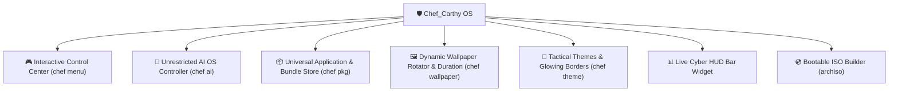

<div align="center">

# 🛡️ Chef_Carthy OS
### *Next-Generation AI-Powered Cybersecurity, Tactical Linux & Universal Application Platform*

[](https://archlinux.org/)
[](https://hyprland.org/)
[](https://python.org/)
[](LICENSE)

<p align="center">
  A complete, beautiful, high-performance Linux OS and tactical cybersecurity platform built for Arch Linux. Combines unrestricted autonomous AI system control (Google Gemini / Google CLI), universal software management (VLC, VMware, OBS, Dev tools), 2,800+ BlackArch security tools, dynamic wallpaper rotation with custom durations, and live cyber HUD telemetry.
</p>

</div>

---

### 🌟 Core Systems & Architecture



---

### 💎 Key Features

#### 1. 🤖 Unrestricted Autonomous AI Controller (`chef ai` / `chef login`)
* Direct integration with **Google Gemini & Google CLI** with full system visibility and zero artificial restrictions.
* Multi-step autonomous tool execution: executes shell commands, inspects logs, manages systemd services, modifies files, and performs end-to-end remediation.
* Simple authentication: `chef login` or prompt on first launch.

#### 2. 📦 Universal Application & Software Store (`chef pkg` / `chef install`)
* **Everyday Desktop Applications**: 1-command installation for `vlc`, `vmware`, `obs`, `firefox`, `brave`, `vscode`, `docker`, `gimp`, `discord`, `steam`.
* **Curated Toolchain Bundles**:
  * `core`: Hyprland, Waybar, Alacritty, Foot, Starship, PipeWire audio.
  * `apps-media`: VLC, MPV, OBS Studio, GIMP, FFmpeg, yt-dlp.
  * `virtualization`: Open-VM-Tools, QEMU/KVM, Virt-Manager, Docker.
  * `cyber-recon`: Nmap, Masscan, Amass, Subfinder, Whois, Traceroute, Arp-scan.
  * `cyber-web`: Mitmproxy, Curlie, HTTPie, Wget, Nikto, SQLMap, FFUF, Burp Suite.
  * `cyber-sniffing`: Wireshark, TCPdump, Termshark, Iftop, Ngrep.
  * `cyber-wireless`: Aircrack-ng, Kismet, Wifite, Reaver.
  * `cyber-passwords`: John the Ripper, Hashcat, Hydra, Crunch.
  * `cyber-forensics`: Sleuthkit, Binwalk, Foremost, TestDisk, Hexedit, Exiftool.
  * `cyber-reversing`: Radare2, Ghidra, Cutter, GDB, Strace, Valgrind.
  * `cyber-defense`: Lynis, ClamAV, UFW, Fail2ban, Audit.
* **BlackArch Repository Integration**: 1-click bootstrap granting access to **2,800+ penetration testing tools** (`chef pkg blackarch`).

#### 3. 🖼️ Dynamic Wallpaper Rotator & Custom Duration (`chef wallpaper`)
* Real-time wallpaper rotation daemon with configurable durations (e.g. `chef wallpaper interval 5m`, `15m`, `30m`, `1h`).
* Instant commands: `chef wallpaper next`, `chef wallpaper random`, `chef wallpaper start`, `chef wallpaper list`.
* Synchronized background updating with Swaybg and Hyprland.

#### 4. 🎨 Tactical Theme & Aesthetics Engine (`chef theme`)
* Synchronized colors across **Hyprland glowing borders**, wallpapers, and terminal colors.
* Pre-configured themes:
  * `cyber-cyan`: Neon Cyber Cyan & Deep Obsidian
  * `matrix-green`: Emerald Phosphor Matrix
  * `synth-amber`: Amber HUD & Titanium Dark Gray
  * `violet-night`: Electric Violet & Midnight Velvet
  * `tokyo-night`: Tokyo Night Indigo & Pastel Blue
  * `blood-red`: Crimson Tactical Red & Obsidian
  * `rick-and-morty`: Multidimensional Portal Green & Cosmic Purple
* Custom theme generator: `chef theme custom <accent_hex> [secondary_hex]`.

#### 5. 🎮 Interactive Control Center (`chef menu`)
* Effortless keyboard-driven terminal dashboard to launch AI sessions, install applications, switch themes, rotate wallpapers, and audit system security.

#### 6. 📊 Live Cyber HUD Bar Widget
* Real-time security posture score, socket telemetry, and 1-click launchers right on your top bar.

#### 7. 🎓 Interactive Cybersecurity Study & Exam Academy (`chef tutor`)
* Interactive learning academy and cheat sheets covering **Network Packet Analysis**, **OWASP Top 10 Defenses**, **Linux Kernel Hardening**, **Cryptography**, **PTES Auditing**, and **Malware Reverse Engineering**.

---

### 🚀 Quick Start & 1-Command Installation

To install **Chef_Carthy OS** on an existing Arch Linux / Omarchy system:

```bash
git clone https://github.com/OLAg-shs/Chef_Carthy.git
cd Chef_Carthy
./install.sh
```

---

### 💻 Command Cheatsheet

| Command | Description |
| :--- | :--- |
| `chef menu` | Launch interactive TUI control panel |
| `chef ai <query>` | Ask the unrestricted AI System Controller |
| `chef login` | Authenticate Google Gemini API Key / Google CLI |
| `chef scan <target>` | Automated network discovery & port scan |
| `chef web <url>` | Automated web application security audit |
| `chef blue` | Inspect active sockets, listening ports & defenses |
| `chef audit` | Run full cybersecurity posture & hardening audit |
| `chef pkg app <vlc\|vmware\|obs>` | Install desktop application presets |
| `chef pkg bundle <id>` | Install a tool bundle (e.g. `cyber-web`, `apps-media`) |
| `chef pkg blackarch` | Integrate official BlackArch repo (2,800+ tools) |
| `chef wallpaper next` | Instantly switch to next wallpaper |
| `chef wallpaper interval <5m>` | Set wallpaper rotation duration |
| `chef wallpaper start` | Start automated background rotator daemon |
| `chef theme list` | List available tactical visual themes |
| `chef theme set <name>` | Apply a theme with synchronized Hyprland glow |
| `chef tutor` | Open interactive Cybersecurity Study Academy |
| `chef update` | Upgrade system, toolchains, AUR packages & clean cache |

---

<div align="center">
  <sub>© 2026 Maccarthy Quest. Designed for speed, security, and automated intelligence.</sub>
</div>
