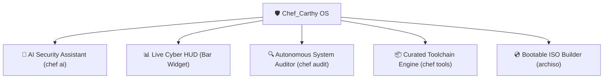

<div align="center">

# 🛡️ Chef_Carthy OS
### *AI-Powered Cybersecurity & Security Auditing Linux Platform*

[](https://archlinux.org/)
[](https://hyprland.org/)
[](https://python.org/)
[](LICENSE)

<p align="center">
  A next-generation Arch Linux security platform combining high-speed Wayland desktop environments, autonomous AI security auditing, live system posture telemetry, and specialized security toolchains.
</p>

</div>

---

### 🌟 Key Systems & Capabilities



#### 1. 🤖 Built-in AI Security Assistant (`chef ai`)
* **Autonomous Telemetry Analysis**: Queries local open ports, socket state, firewall posture, and system logs to identify configuration oversights.
* **Intelligent Hardening Playbooks**: Generates customized kernel (`sysctl`) and firewall rules tailored to the current network configuration.
* **Log Anomaly Detection**: Parses journal and authentication logs to flag brute-force or elevated privilege anomalies.

#### 2. 📊 Live Cyber HUD Bar Widget
* Embedded Wayland status pill showing live security baseline score (`88% Hardened Base`).
* 1-Click launcher for security audits, network topology inspection, and the interactive AI terminal.

#### 3. 📦 Curated Security & Auditing Toolchains
* **Network & Traffic Inspection**: `wireshark-qt`, `tcpdump`, `termshark`, `nmap`, `net-tools`
* **Web & API Auditing**: `mitmproxy`, `curlie`, `httpie`, `wget`, `nikto`
* **Forensics & Incident Response**: `sleuthkit`, `binwalk`, `foremost`, `testdisk`, `hexedit`
* **Binary & Reverse Engineering**: `radare2`, `gdb`, `strace`, `ltrace`, `valgrind`
* **Defensive Hardening**: `lynis`, `clamav`, `ufw`, `fail2ban`, `audit`

---

### 🚀 Quick Start & Installation

To install **Chef_Carthy OS** on an existing Arch Linux / Omarchy system:

```bash
git clone https://github.com/OLAg-shs/Chef_Carthy.git
cd Chef_Carthy
./install.sh
```

---

### 💻 Command Reference

```bash
# 1. Run a full security posture and hardening audit
chef audit

# 2. Query the built-in AI Security Assistant
chef ai "audit my open listening ports and suggest firewall rules"
chef ai "analyze my authentication logs for brute force attempts"

# 3. Scan network interfaces and active sockets
chef network

# 4. View and install toolchains by category
chef tools list
chef tools install network
chef tools install web
chef tools install reversing
```

---

### 💿 Building a Bootable Standalone ISO

Chef_Carthy OS includes an official `archiso` profile for compiling live bootable ISO images:

```bash
cd iso
./build_iso.sh
```

The resulting ISO in `iso/out/chef-carthy-os-*.iso` can be flashed to a USB drive or booted in QEMU/VirtualBox.

---

<div align="center">
  <sub>© 2026 Maccarthy Quest. Designed for speed, security, and automated intelligence.</sub>
</div>
