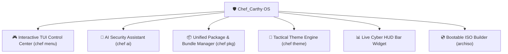

<div align="center">

# 🛡️ Chef_Carthy OS
### *Next-Generation AI-Powered Cybersecurity & Tactical Linux Platform*

[](https://archlinux.org/)
[](https://hyprland.org/)
[](https://python.org/)
[](LICENSE)

<p align="center">
  A complete, beautiful, low-overhead Linux OS and tactical cybersecurity platform built for Arch Linux. Combines unified package and bundle management, tactical glassmorphic aesthetics, autonomous AI security auditing, live system telemetry HUD, and turnkey ISO builder recipes.
</p>

</div>

---

### 🌟 Core Systems & Architecture



---

### 💎 Key Features

#### 1. 🎮 Interactive Control Center (`chef menu`)
* Effortless keyboard-driven terminal dashboard to launch security audits, install bundles, switch themes, and query the AI assistant in seconds.

#### 2. 📦 Unified Package & Bundle Manager (`chef pkg`)
* **Zero-overhead package manager** wrapping `pacman` and `yay` with colored output and dependency cleaning.
* **Curated Toolchain Bundles**:
  * `core`: Hyprland, Waybar, Alacritty, Foot, Starship, PipeWire audio.
  * `cyber-network`: Wireshark, TCPdump, Termshark, Nmap, Net-tools.
  * `cyber-web`: Mitmproxy, Curlie, HTTPie, Wget, Nikto.
  * `cyber-forensics`: Sleuthkit, Binwalk, Foremost, TestDisk, Hexedit.
  * `cyber-reversing`: Radare2, GDB, Strace, Ltrace, Valgrind.
  * `cyber-hardening`: Lynis, ClamAV, UFW, Fail2ban, Audit.
  * `dev`: Python, Rust, GCC, Clang, Docker, Git, Neovim.

#### 3. 🎨 Tactical Theme & Aesthetics Engine (`chef theme`)
* Synchronized colors across **Hyprland glowing borders**, wallpapers, and terminal colors.
* Pre-configured themes:
  * `cyber-cyan`: Neon Cyber Cyan & Deep Obsidian
  * `matrix-green`: Emerald Phosphor Matrix
  * `synth-amber`: Amber HUD & Titanium Dark Gray
  * `violet-night`: Electric Violet & Midnight Velvet

#### 4. 🤖 Built-in AI Security Assistant (`chef ai`)
* Analyzes local network ports, listening sockets, kernel parameters (`sysctl`), and logs to guide system hardening and defense.

#### 5. 📊 Live Cyber HUD Bar Widget (`[ 🛡️ Cyber | 88% ]`)
* Real-time security posture score, socket telemetry, and 1-click launchers right on your top bar.

#### 6. 💿 Bootable Standalone ISO Builder (`iso/`)
* Standard `archiso` recipes (`mkarchiso`) to compile bootable live `.iso` images for bare-metal or virtual machine installations.

---

### 🚀 Quick Start & 1-Command Installation

To install **Chef_Carthy OS** on an existing Arch Linux / Omarchy system:

```bash
git clone https://github.com/OLAg-shs/Chef_Carthy.git
cd Chef_Carthy
./install.sh
```

---

### 💻 Command Cheatsheet

| Command | Description |
| :--- | :--- |
| `chef menu` | Launch interactive TUI control panel |
| `chef audit` | Run full cybersecurity posture & hardening audit |
| `chef ai <query>` | Ask the built-in AI Security Assistant |
| `chef network` | Inspect active interfaces, open sockets & routing |
| `chef pkg bundles` | List all curated security & developer bundles |
| `chef pkg bundle <id>` | Install a tool bundle (e.g. `cyber-network`, `cyber-web`) |
| `chef install <pkg>` | Install packages via pacman & AUR |
| `chef update` | Upgrade system, toolchains, AUR packages & clean cache |
| `chef theme list` | List available tactical visual themes |
| `chef theme set <name>`| Apply a theme with synchronized Hyprland glow |
| `chef iso` | Compile a bootable standalone `.iso` with `mkarchiso` |

---

<div align="center">
  <sub>© 2026 Maccarthy Quest. Designed for speed, security, and automated intelligence.</sub>
</div>
